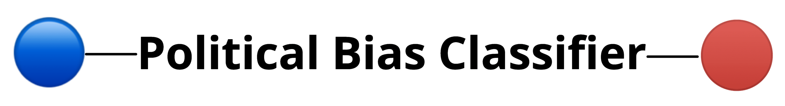

## Summary

This program classifies a sequence of text as either "partisan" or "neutral" using machine learning and sentiment analysis. 

## Model and data

The trained model is stored as a pickled file in `compressed_trained_model.pklz` which is 85.6 MB and can be downloaded at this [link](https://drive.google.com/file/d/1-GpghIfWqZcTR-KNek-Jj2T3pKzVbgE_/view?usp=sharing).  Note that the intitial model training was done as part of an extension project for my computer science class. Therefore, I cannot release the code where the model was trained. In short, the model is a Naive Bayes Classifier trained on `data/train.csv` and evaluated on `data/test.csv`. The Textblob library was used. The original data was adapted from [here](https://www.kaggle.com/crowdflower/political-social-media-posts) and was manually preprocessed. The `pred.py` file holds a function `predict_text` that is utilized in the runner files which loads the model, processes the inputted text, and returns the result. 

## Running instructions

You can either use the program by running it on your local server, or you can, conveniantly use it on the following website: [politicalbias.pythonanywhere.com](http://politicalbias.pythonanywhere.com/) 

If you would like to run this program on your local computer, please download/clone the repository and follow these steps: 

1. Install the necessary dependencies: `$ pip install -r requirements.txt`. 
2. Install Textblob's corpora: `$ python -m textblob.download_corpora`. 
3. Download the model file from this [link](https://drive.google.com/file/d/1-GpghIfWqZcTR-KNek-Jj2T3pKzVbgE_/view?usp=sharing) and save it in the same directory where you cloned the repository. 
4. Run `run.py` (`$ python run.py`) and follow the directions within the program. 

## Web application

Like mentioned, you can use the program through the web at [politicalbias.pythonanywhere.com](http://politicalbias.pythonanywhere.com/). The application was built using Flask which essentially allows the user inputted text to be stored in a Python string variable. This string is then sent into the model which processes the result. The result is then shown by rendering an new HTML document. In terms of files, the Flask app was built in `app.py`, the `static` subdirectory was used to store the banner image, and the `templates` subdirectory holds the HTML documents that are rendered through the Flask app routing.  The web application is hosted on [pythonanywhere](https://www.pythonanywhere.com/). Note that the `index.html` in this main directory is just used for routing from my personal website domain through Github Pages. Visual: 

